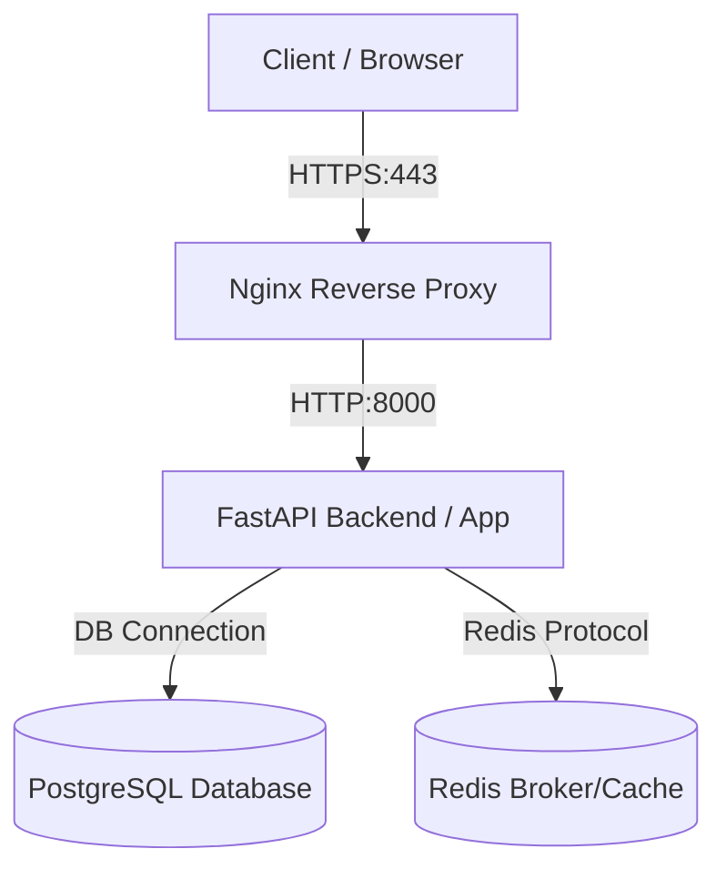

# Production Deployment Guide: SOCForge

This guide outlines the production deployment practices for running SOCForge securely, reliably, and at scale.

---

## 1. Production Architecture Blueprint
In a production environment, SOCForge is deployed using Docker Compose with an Nginx reverse proxy handling SSL termination and routing requests to the FastAPI backend and static assets.



---

## 2. Docker Compose Production Configuration
Below is a hardened `docker-compose.prod.yml` configuration:

```yaml
version: '3.8'

services:
  db:
    image: postgres:15-alpine
    container_name: socforge-db-prod
    environment:
      POSTGRES_DB: socforge
      POSTGRES_USER: socforge_admin
      POSTGRES_PASSWORD: ${DB_PASSWORD}
    volumes:
      - postgres_data:/var/lib/postgresql/data
    restart: always
    networks:
      - socforge-net

  redis:
    image: redis:7-alpine
    container_name: socforge-redis-prod
    command: redis-server --requirepass ${REDIS_PASSWORD}
    volumes:
      - redis_data:/data
    restart: always
    networks:
      - socforge-net

  backend:
    build:
      context: ..
      dockerfile: docker/backend.Dockerfile
    container_name: socforge-backend-prod
    environment:
      - DATABASE_URL=postgresql://socforge_admin:${DB_PASSWORD}@db:5432/socforge
      - REDIS_URL=redis://:${REDIS_PASSWORD}@redis:6379/0
      - SECRET_KEY=${SECRET_KEY}
      - ENV=production
    depends_on:
      - db
      - redis
    restart: always
    networks:
      - socforge-net

  nginx:
    image: nginx:alpine
    container_name: socforge-nginx-prod
    ports:
      - "80:80"
      - "443:443"
    volumes:
      - ./nginx.conf:/etc/nginx/nginx.conf:ro
      - /etc/letsencrypt:/etc/letsencrypt:ro
    depends_on:
      - backend
    restart: always
    networks:
      - socforge-net

volumes:
  postgres_data:
  redis_data:

networks:
  socforge-net:
    driver: bridge
```

---

## 3. Nginx Reverse Proxy Configuration (`nginx.conf`)
Deploy Nginx to handle SSL/TLS certificate termination and direct API routing:

```nginx
events { worker_connections 1024; }

http {
    include       mime.types;
    default_type  application/octet-stream;

    # SSL Settings
    ssl_protocols TLSv1.2 TLSv1.3;
    ssl_prefer_server_ciphers on;
    ssl_ciphers 'ECDHE-ECDSA-AES256-GCM-SHA384:ECDHE-RSA-AES256-GCM-SHA384';

    server {
        listen 80;
        server_name socforge.yourdomain.com;
        return 301 https://$host$request_uri;
    }

    server {
        listen 443 ssl;
        server_name socforge.yourdomain.com;

        ssl_certificate /etc/letsencrypt/live/socforge.yourdomain.com/fullchain.pem;
        ssl_certificate_key /etc/letsencrypt/live/socforge.yourdomain.com/privkey.pem;

        location / {
            proxy_pass http://backend:8000;
            proxy_set_header Host $host;
            proxy_set_header X-Real-IP $remote_addr;
            proxy_set_header X-Forwarded-For $proxy_add_x_forwarded_for;
            proxy_set_header X-Forwarded-Proto $scheme;
        }

        # WebSocket Streaming Connection
        location /api/v1/stream {
            proxy_pass http://backend:8000;
            proxy_http_version 1.1;
            proxy_set_header Upgrade $http_upgrade;
            proxy_set_header Connection "upgrade";
            proxy_set_header Host $host;
        }
    }
}
```

---

## 4. Database Volume Backups
To schedule daily automated backups of your PostgreSQL database, configure a cron job on the host node executing the following script:

```bash
#!/bin/bash
BACKUP_DIR="/var/backups/socforge"
DATE=$(date +\%Y-\%m-\%d_\%H-\%M-\%S)
mkdir -p $BACKUP_DIR
docker exec -t socforge-db-prod pg_dump -U socforge_admin socforge > $BACKUP_DIR/socforge_backup_$DATE.sql
find $BACKUP_DIR -type f -mtime +7 -name "*.sql" -delete
```

---

## 5. Deployment Step-by-Step
1. Copy the production Docker and Nginx configs into your deployment server.
2. Initialize environment variables in a `.env` file (e.g. `DB_PASSWORD`, `REDIS_PASSWORD`, `SECRET_KEY`).
3. Run `docker compose -f docker-compose.prod.yml up -d --build`.
4. Setup Let's Encrypt certificates using `certbot certonly --standalone -d socforge.yourdomain.com`.
5. Restart the Nginx container to load the cert files.
